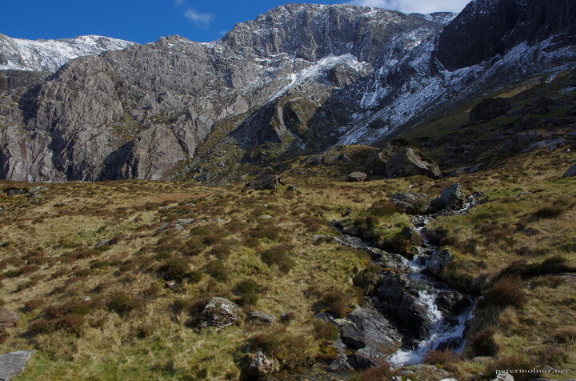

---
author:
    email: mail@petermolnar.net
    image: https://petermolnar.net/favicon.jpg
    name: Peter Molnar
    url: https://petermolnar.net
coordinates:
    latitude: 53.119272
    longitude: -4.022369
copies:
- https://www.flickr.com/photos/36003160@N08/28330432044
- http://web.archive.org/web/20170212081945/https://petermolnar.net/stream-at-llyn-idwal-2/
published: '2016-08-13T09:00:58+00:00'
syndicate:
- https://brid.gy/publish/flickr
tags:
- Llyn Idwal
- winter
- spring
- cloudy
- Snowdonia
- mountain
- clouds
- mountains
- snow
- Wales
title: Stream at Llyn Idwal 2

---

Afternoon sun, snow on the top of the mountains, streams wherever you
look - Snowdonia is magnificent during spring.