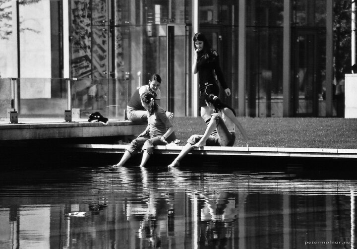

---
author:
    email: mail@petermolnar.net
    image: https://petermolnar.net/favicon.jpg
    name: Peter Molnar
    url: https://petermolnar.net
copies:
- https://www.flickr.com/photos/36003160@N08/15357701652
- http://web.archive.org/web/20141019222609/https://petermolnar.eu/photo/summer/
published: '2014-09-25T10:00:00+00:00'
syndicate:
- https://brid.gy/publish/flickr
tags:
- Budapest
- black & white
- girls
- black
title: Summer

---

This is one of the rare images I took with an analogue machine. The
original is colour, but I knew this was going to be a black and white
one in the end. The scan of the negative was done in a common quick lab,
the black & white conversion by Rawtherapee.

It was taken not much later the freshly renovated Erzsébet tér was
opened in Budapest.