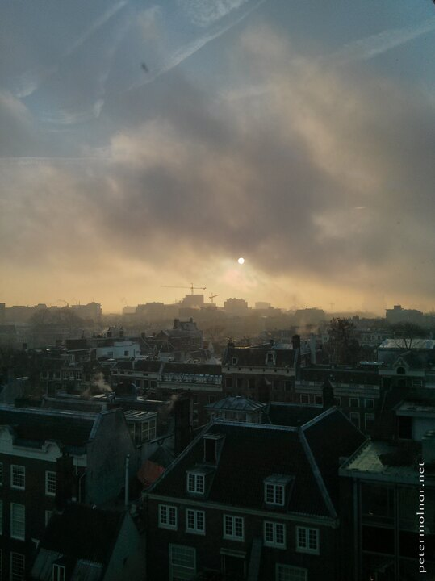

---
author:
    email: mail@petermolnar.net
    image: https://petermolnar.net/favicon.jpg
    name: Peter Molnar
    url: https://petermolnar.net
coordinates:
    latitude: 52.3658190001139
    longitude: 4.897874
copies:
- https://www.flickr.com/photos/36003160@N08/14958952108
- http://web.archive.org/web/20141013225953/https://petermolnar.eu/photo/sunrise-amsterdam-winter-sunrise/
published: '2014-09-05T09:00:49+00:00'
syndicate:
- https://brid.gy/publish/flickr
tags:
- gloomy
- Netherlands
- Amsterdam
- sunrise
title: Sunrise - Amsterdam winter sunrise

---

Working at a Friday after the Christmas Party of the company is not
always the experience we're looking forward for; except when we're
granted with views like this, a sunrise on a gloomy morning, where our
Sun looks dying and sick above Amsterdam.