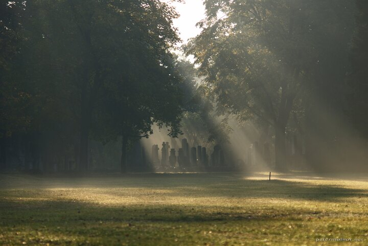

---
author:
    email: mail@petermolnar.net
    image: https://petermolnar.net/favicon.jpg
    name: Peter Molnar
    url: https://petermolnar.net
coordinates:
    latitude: 47.492942
    longitude: 19.091824
copies:
- https://www.flickr.com/photos/36003160@N08/14949606788
- http://web.archive.org/web/20141013210751/https://petermolnar.eu/photo/sunrise-hungarian-national-graveyard/
published: '2010-10-14T09:00:00+01:00'
syndicate:
- https://brid.gy/publish/flickr
tags:
- lights
- autumn
- gravestone
- grave
- graveyard
title: Sunrise - Hungarian National Graveyard

---

When the October weather reached it's peak beauty, I decided to get up
early enough to catch the sunrise in the Hungarian National Graveyard.
Though I ended up with miraculous images, it was a bit cold, and I
wished sunrise would last much longer.

This particular photo was taken when I was about to leave and for a
hunch, I've turned back for a moment, to wave goodbye to the place.
Thank you, hunch :)