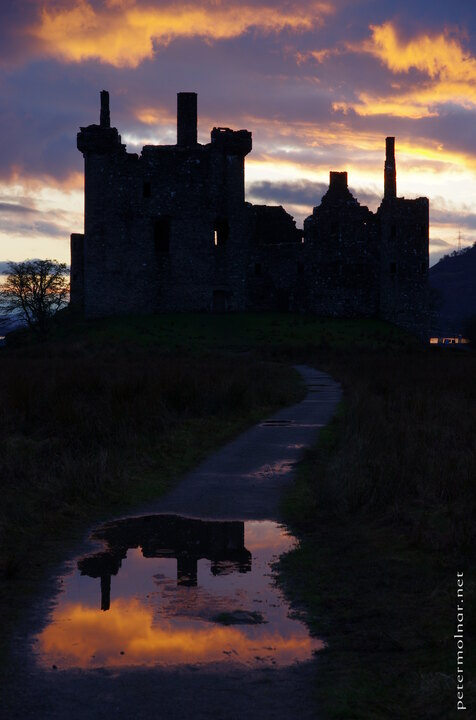

---
author:
    email: mail@petermolnar.net
    image: https://petermolnar.net/favicon.jpg
    name: Peter Molnar
    url: https://petermolnar.net
copies:
- https://www.flickr.com/photos/36003160@N08/38280664562
- http://web.archive.org/web/20190624130243/https://petermolnar.net/sunset-at-kilchurn-castle/
published: '2017-11-05T18:00:00+00:00'
syndicate:
- https://brid.gy/publish/flickr
tags:
- Loch Awe
- sunset
- water
- lake
- sky
- Kilchurn Castle
- Scotland
- scottish
- silhouette
title: Sunset at Kilchurn Castle

---

At the end of a wonderful organised day tour we visited Loch Awe and
Kilchurn Castle. We a decent weather all the day - given it was winter
in Scotland, I was very glad for it, but the sunset was certainly
magnificent.