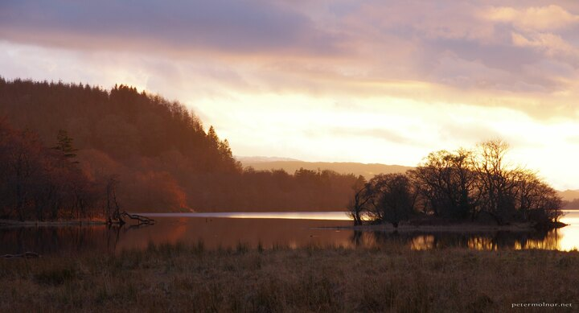

---
author:
    email: mail@petermolnar.net
    image: https://petermolnar.net/favicon.jpg
    name: Peter Molnar
    url: https://petermolnar.net
copies:
- https://www.flickr.com/photos/36003160@N08/38194186206
- http://web.archive.org/web/20190624130246/https://petermolnar.net/sunset-island-on-loch-awe/
published: '2017-11-03T18:00:00+00:00'
syndicate:
- https://brid.gy/publish/flickr
tags:
- Loch Awe
- sunset
- water
- lake
- sky
- scottish
- Scotland
title: Island on Loch Awe

---

Sunsets have been photographed so many times that when you see one
that's truly outstanding you end up finding yourself looking for excuses
why you took the picture. It's simple: it was, in fact, beautiful.