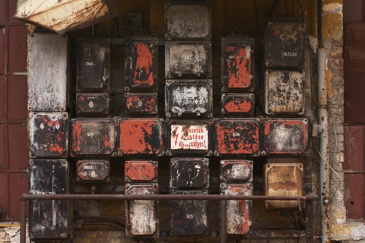

---
author:
    email: mail@petermolnar.net
    image: https://petermolnar.net/favicon.jpg
    name: Peter Molnar
    url: https://petermolnar.net
coordinates:
    latitude: 47.47016
    longitude: 19.077318
copies:
- https://www.flickr.com/photos/36003160@N08/15089403949
- http://web.archive.org/web/20141014035651/https://petermolnar.eu/photo/switch-box/
published: '2014-09-18T09:00:56+00:00'
syndicate:
- https://brid.gy/publish/flickr
tags:
- Budapest
- switch-box
- derelict
- electricity
title: Switch-box

---

Budapest has some fairly abandoned locations, including most of the
areas of the old abattoir. This is a still in use, working
electricity-distributor box.