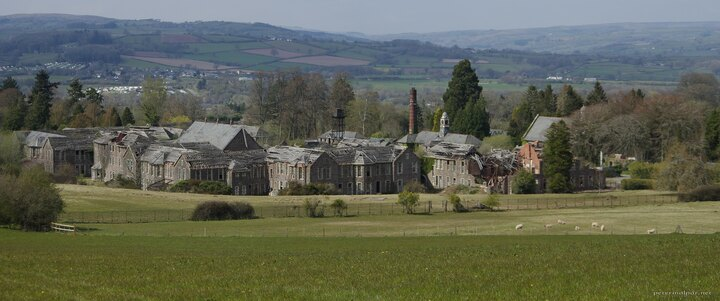

---
author:
    email: mail@petermolnar.net
    image: https://petermolnar.net/favicon.jpg
    name: Peter Molnar
    url: https://petermolnar.net
copies:
- https://www.flickr.com/photos/36003160@N08/51160558472
- http://web.archive.org/web/20210506114336/https://petermolnar.net/photo/talgarth-asylum/
published: '2021-05-06T09:00:00+01:00'
title: Talgarth Asylum

---

On my way down from Pwll-y-Wrach, in the distance, I spotted something
that on the map was only marked as "hospital". Apparently I stumbled
upon Talgarth Asylum, a clinic that was closed only 20 years ago. In
that 20 years, it got stripped of the slate on the roof and left to rot.
The locals use the field next to it for picnic, among a serious amount
of asbestos warning signs - by looking in the windows there's cracked
AIB ceiling everywhere, so I got as far as I could fast.

The internet then showed me how this place looked only 11 years ago[^1]
and it's hard to believe how much destruction 11 years of weather - and
looting - can do to a place.

[^1]: <https://www.derelictplaces.co.uk/threads/talgarth-asylum-wales.31652/#post-320711>