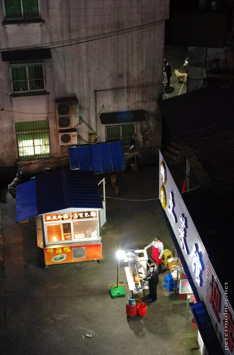

---
author:
    email: mail@petermolnar.net
    image: https://petermolnar.net/favicon.jpg
    name: Peter Molnar
    url: https://petermolnar.net
copies:
- https://www.flickr.com/photos/petermolnareu/48592722157
- http://web.archive.org/web/20190821204332/https://petermolnar.net/tangkoucun/
published: '2019-08-21T15:30:00+01:00'
syndicate:
- https://brid.gy/publish/flickr
tags:
- China
- People's Republic of China
- Huangshan
- night
- street life
title: Tangkoucun 汤口村

---

Tangkoucun ( 汤口村 ) is the small town at the feet of Huangshan
mountains - this is where the bus to the scenic area takes you to. If
you get here in dark, it's certainly not one of the most welcoming
looking places, but it gets a lot nicer in light.
