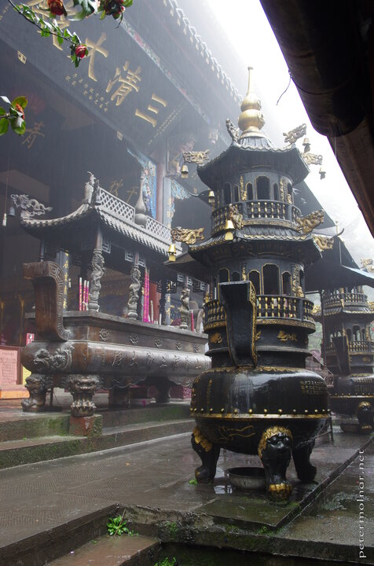

---
author:
    email: mail@petermolnar.net
    image: https://petermolnar.net/favicon.jpg
    name: Peter Molnar
    url: https://petermolnar.net
coordinates:
    latitude: 30.89705
    longitude: 103.566752
copies:
- https://www.flickr.com/photos/36003160@N08/27108731965
- http://web.archive.org/web/20190624130300/https://petermolnar.net/taoist-temple-on-mount-qingcheng/
published: '2016-05-19T10:00:52+00:00'
syndicate:
- https://brid.gy/publish/flickr
tags:
- People's Republic of China
- Sichuan
- temple
- taoist
- religion
- mysterious
- China
- Mount Qingcheng
- taoism
title: Taoits Temple on Mount Qingcheng

---

I think these temples on Mount Qingcheng are always exceptional, but the
mist and the rain adds to the mystery for sure.

It's both a bless and a curse to be in a place like this with bad
weather: minimal amount of tourists, compared to the normal, but you
won't see the top of the buildings yourself either.