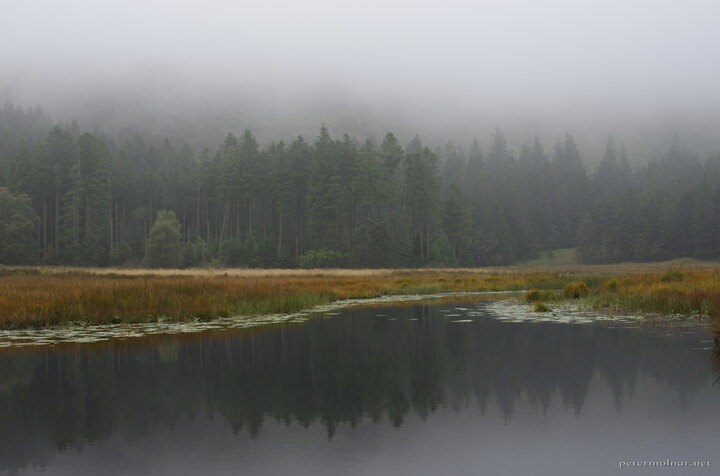

---
author:
    email: mail@petermolnar.net
    image: https://petermolnar.net/favicon.jpg
    name: Peter Molnar
    url: https://petermolnar.net
coordinates:
    latitude: 54.514224
    longitude: -3.065003
copies:
- https://www.flickr.com/photos/36003160@N08/21463777384
- http://web.archive.org/web/20190624130301/https://petermolnar.net/tarn-in-mist/
published: '2015-10-11T07:58:39+00:00'
syndicate:
- https://brid.gy/publish/flickr
tags:
- pond
- autumn
- forest
- fog
- mist
- tarn
- fir
- lake
- pine
- water
title: Tarn in mist

---

Back when I started taking photographs a bit more seriously I came
across a professional artist: Adam Gibbs[^1]. Since he is also a
mounteneer he gets to places literally noone else does.

During our short, three days stay in the Lake District we decided to
spend one of the days climbing up to a tarn - a smal lake on a top of a
hill. It wasn't too steep yet it took a long time to climb it, mostly
because of the uncleaned routes; I took this picture while it was still
misty all around.

I do envy Adam for getting those locations, but excursions like this
keep remind me how much work goes into a single picture.

[^1]: <http://adamgibbs.ca/>