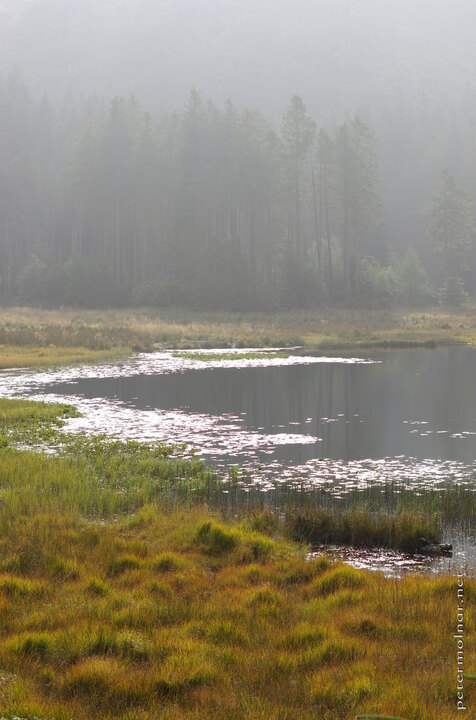

---
author:
    email: mail@petermolnar.net
    image: https://petermolnar.net/favicon.jpg
    name: Peter Molnar
    url: https://petermolnar.net
coordinates:
    latitude: 54.514156
    longitude: -3.065657
copies:
- https://www.flickr.com/photos/36003160@N08/21510607903
- http://web.archive.org/web/20190624130303/https://petermolnar.net/tarn-in-sunshine/
published: '2015-10-13T09:41:17+00:00'
syndicate:
- https://brid.gy/publish/flickr
tags:
- sunshine
- pond
- autumn
- forest
- tarn
- lake
- woodland
- mist Lake District
title: Tarn in sunshine

---

After a long while, when we were returning and passing by the same tarn
as earlier, the sun came out for a little while, lighting up all the
area, including the still present mist on the other side of the lake.

It's a little devastating to realize how easy is to get used to the
accessability of many locations - most of the famous places are now
surprisingly close to a car park, for example. But if you go further, to
locations that are not hyped attractions, you'll see real beauty.

I have the theory that some areas willingly sacrificing a few blocks to
the general public - encouriging every to see those and those only,
while the real gems stay hidden, at the end of path, covered by fern an
pines.