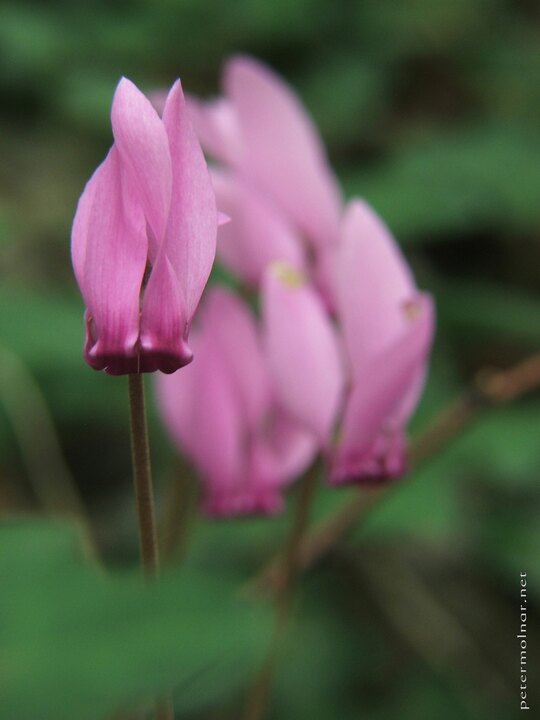

---
author:
    email: mail@petermolnar.net
    image: https://petermolnar.net/favicon.jpg
    name: Peter Molnar
    url: https://petermolnar.net
copies:
- http://web.archive.org/web/20200923081154/https://petermolnar.net/photo/the-lonely-one/
published: '2005-08-02T10:45:46+00:00'
tags:
- flower
- alone
title: The lonely one

---

One if my early attempts at macro photography. The Fuji S5500, even
though it was a bridge camera, had the option for filters, and was
capable of taking surprisingly decent macros that way.