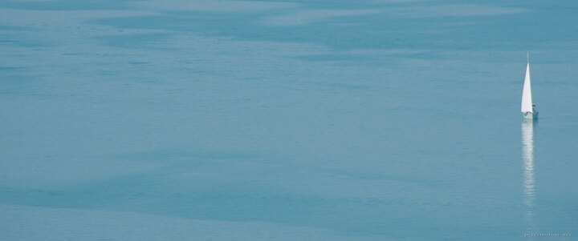

---
author:
    email: mail@petermolnar.net
    image: https://petermolnar.net/favicon.jpg
    name: Peter Molnar
    url: https://petermolnar.net
copies:
- https://www.flickr.com/photos/36003160@N08/35648394706
- http://web.archive.org/web/20190624130327/https://petermolnar.net/tihany/
published: '2017-01-02T13:00:00+00:00'
syndicate:
- https://brid.gy/publish/flickr
tags:
- Balaton
- summer
- boat
- sailor
- minimal
- water
- reflection
title: Tihany

---

It is always hard to take pictures of places you know well: when you've
seen places countless times none of the scenery look extraordinary
enough to fossilise it for eternity.

Thankfully, there are exceptions. This was taken in Tihany, at a
beautiful, sunny day, when thankfully enough sailing ships were out on
the water. All the colours were in place and I loved the reflections -
you definitely need to wait much, much longer at places you know for a
good moment, but it worth it.