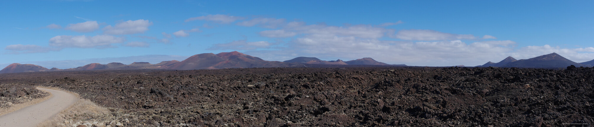

---
author:
    email: mail@petermolnar.net
    image: https://petermolnar.net/favicon.jpg
    name: Peter Molnar
    url: https://petermolnar.net
copies:
- https://www.flickr.com/photos/36003160@N08/27377134809
- http://web.archive.org/web/20190624130329/https://petermolnar.net/timanfaya-national-park/
published: '2017-12-18T08:00:00+00:00'
syndicate:
- https://brid.gy/publish/flickr
tags:
- Canary Islands
- Lanzarote
- volcano
- vulcanic
- vulcano
title: Panorama of Timanfaya National Park

---

The Timanfaya National Park is a vast wasteland of volcanic eruptions
happened mostly around 1730. It is unique, beautiful, looks like an
alien planet, and quite dangerous to walk on your own. The road on the
left is the route the camels take when going to work and getting home -
they are only serving tourists these days though.

My camera doesn't have a panorama function: this image is glued from 3
handheld shoots, combined perfectly with a program called Hugin.