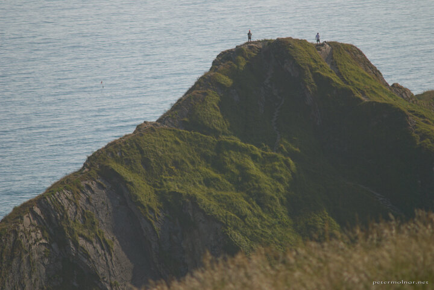

---
author:
    email: mail@petermolnar.net
    image: https://petermolnar.net/favicon.jpg
    name: Peter Molnar
    url: https://petermolnar.net
coordinates:
    latitude: 50.62122
    longitude: -2.275865
copies:
- https://www.flickr.com/photos/36003160@N08/15182965496
- http://web.archive.org/web/20141014121018/https://petermolnar.eu/photo/top-of-the-world-durdle-door/
published: '2014-09-11T09:00:23+00:00'
syndicate:
- https://brid.gy/publish/flickr
tags:
- sea
- Durdle Door
- view
- hill
- tourists
title: Top of the World - Durdle Door

---

Original target: South-Wales. After getting out of the car in Costwolds,
we decided to turn down and visit the sea due to the nearly 30 °C
outside. Incredibly cold water, beautiful location and view, crazy
tourists in top of the hill.