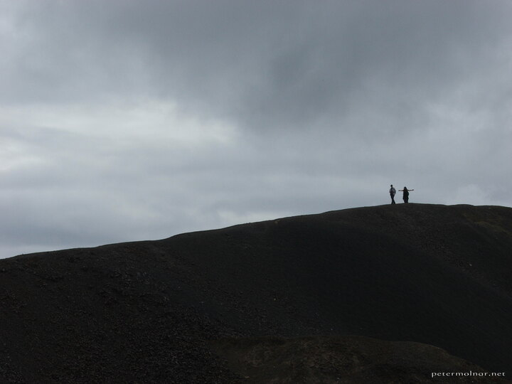

---
author:
    email: mail@petermolnar.net
    image: https://petermolnar.net/favicon.jpg
    name: Peter Molnar
    url: https://petermolnar.net
coordinates:
    latitude: 62.5786
    longitude: 11.38132
copies:
- https://www.flickr.com/photos/36003160@N08/15211496681
- http://web.archive.org/web/20141014124540/https://petermolnar.eu/photo/top-of-the-world-roros/
published: '2014-09-12T09:00:24+00:00'
syndicate:
- https://brid.gy/publish/flickr
tags:
- Norway
- mountain
- hill
- Røros
title: Top of the World - Røros

---

In 2006 I was lucky enough to be part of a 16 bus-trip in Norway. I've
seen miraculous places, including the small town of Røros, with it's
abandoned copper mine and the leftover hills of it.