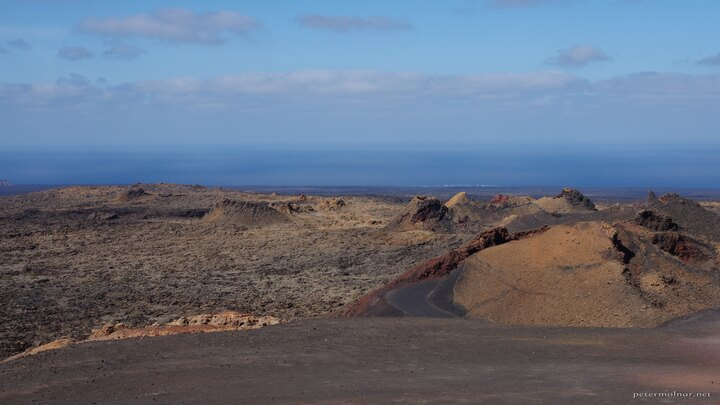

---
author:
    email: mail@petermolnar.net
    image: https://petermolnar.net/favicon.jpg
    name: Peter Molnar
    url: https://petermolnar.net
copies:
- https://www.flickr.com/photos/36003160@N08/38377523694
- http://web.archive.org/web/20190624130335/https://petermolnar.net/top-of-timanfaya/
published: '2017-12-16T08:00:00+00:00'
syndicate:
- https://brid.gy/publish/flickr
tags:
- Canary Islands
- Lanzarote
- volcano
- vulcanic
- vulcano
- sea
title: The top of Timanfaya

---

At the top of Timanfaya National Park on Lanzarote, there is a building,
designed by César Manrique, called El Diablo: it uses completely natural
hot air coming from the depths of the Earth to cook. This is the view in
front of it.