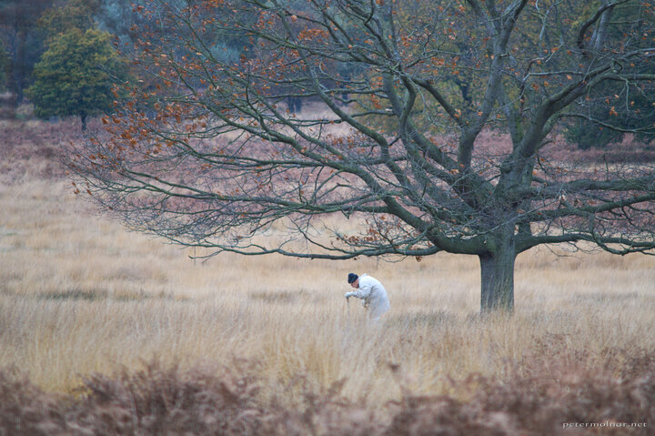

---
author:
    email: mail@petermolnar.net
    image: https://petermolnar.net/favicon.jpg
    name: Peter Molnar
    url: https://petermolnar.net
coordinates:
    latitude: 51.447748
    longitude: -0.27749
copies:
- https://www.flickr.com/photos/36003160@N08/15012393856
- http://web.archive.org/web/20141013215027/https://petermolnar.eu/photo/trees-autumn/
published: '2014-08-25T20:00:05+00:00'
syndicate:
- https://brid.gy/publish/flickr
tags:
- Richmond Park
- elder
- autumn
- tree
- old
title: Trees - Autumn

---

Richmond Park in London is a magnificent place, at any time of the year.
All the autumn colours, the deer blending into the fading browns and
yellows; and scenes like this, scenes with emotions, scenes that makes
you stop and wonder for a while.