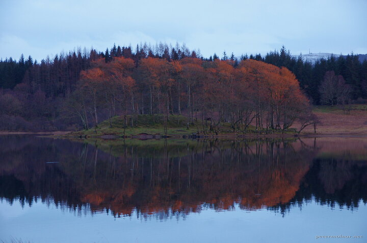

---
author:
    email: mail@petermolnar.net
    image: https://petermolnar.net/favicon.jpg
    name: Peter Molnar
    url: https://petermolnar.net
copies:
- https://www.flickr.com/photos/36003160@N08/38181794446
- http://web.archive.org/web/20190624130344/https://petermolnar.net/trees-burning-in-the-sunset/
published: '2017-11-02T18:00:00+00:00'
syndicate:
- https://brid.gy/publish/flickr
tags:
- Loch Awe
- sunset
- water
- lake
- sky
- scottish
- Scotland
title: Trees burning in the sunset

---

We passed this tiny island on our way to Kilchurn Castle and back. Going
there, they were simple, grey trees, but when the sun was setting, it
was lighting up the branches just like it was the colour of the leaves
or the trees themselves. You need to look closely to realise, it's only
a trick of the light.