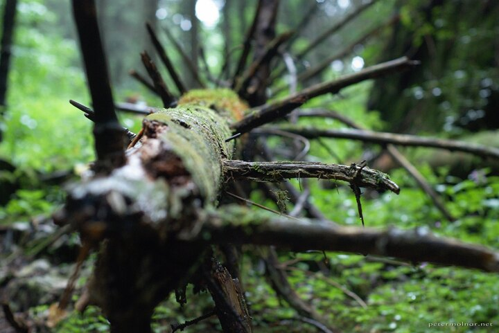

---
author:
    email: mail@petermolnar.net
    image: https://petermolnar.net/favicon.jpg
    name: Peter Molnar
    url: https://petermolnar.net
coordinates:
    latitude: 48.840203
    longitude: 20.374317
copies:
- https://www.flickr.com/photos/36003160@N08/15122864771
- http://web.archive.org/web/20140922220813/https://petermolnar.eu/photo/trees-death-of-a-pine/
published: '2014-09-03T07:48:06+00:00'
syndicate:
- https://brid.gy/publish/flickr
tags:
- dead
- Slovenský raj
- spiked
- green
- forest
- pine
title: Trees - death of a pine

---

I've captured this in the Slovak Paradise and this is probably the only
photo with the Nikon D80 that ever reproduced greens nearly at the same
level a Fuji does.