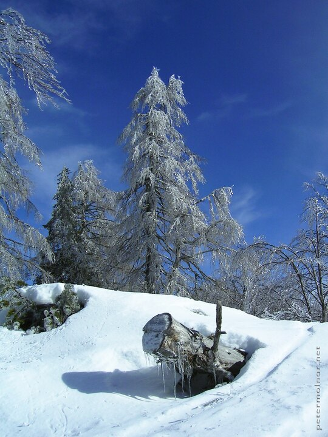

---
author:
    email: mail@petermolnar.net
    image: https://petermolnar.net/favicon.jpg
    name: Peter Molnar
    url: https://petermolnar.net
copies:
- https://www.flickr.com/photos/36003160@N08/15119789592
- http://web.archive.org/web/20190624130347/https://petermolnar.net/trees-forest-of-ice/
published: '2014-09-02T18:25:12+00:00'
syndicate:
- https://brid.gy/publish/flickr
tags:
- winter
- cold
- forest
- ice
- fir
- trees
- snow
- pine
- frozen
title: Trees - Forest of ice

---

This was the scenery that made me start taking photos seriously. During
a few days of skying in Slovenia, at one of the mornings I saw these
threes at the top of the mountain: all of them frozen in ice, all
beautiful and surreal, with untouched snow, and crispy, crystal clear
sky.