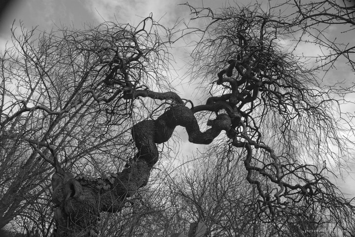

---
author:
    email: mail@petermolnar.net
    image: https://petermolnar.net/favicon.jpg
    name: Peter Molnar
    url: https://petermolnar.net
coordinates:
    latitude: 48.183092
    longitude: 16.401847
copies:
- https://www.flickr.com/photos/36003160@N08/14825257098
- http://web.archive.org/web/20150531190128/https://petermolnar.eu/photo/trees-harridan-of-st-marx/
published: '2014-08-23T20:00:02+00:00'
syndicate:
- https://brid.gy/publish/flickr
tags:
- Vienna
- witch
- cemetery
- hag
- harridan
- tree
- graveyard
title: Trees - Harridan of St. Marx

---

There is a romantic period graveyard, St. Marx Friedhof, in Vienna. I
was reading a text on the history of the graveyard and by looking up
from it I saw this "tree", this witch, guarding the dead.