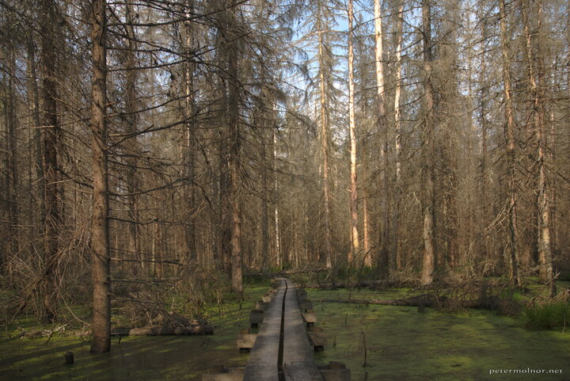

---
author:
    email: mail@petermolnar.net
    image: https://petermolnar.net/favicon.jpg
    name: Peter Molnar
    url: https://petermolnar.net
coordinates:
    latitude: 59.789407
    longitude: 17.703437
copies:
- https://www.flickr.com/photos/36003160@N08/14859694870
- http://web.archive.org/web/20141013182332/https://petermolnar.eu/photo/trees-norra-lunsen/
published: '2014-08-26T20:00:07+00:00'
syndicate:
- https://brid.gy/publish/flickr
tags:
- fen
- Norra Lunsen
- forest
- trees
- moor
- bog
- Sweden
title: Trees - Norra Lunsen

---

Norra Lunsen[^1] is a nature reserve right next to the Swedish city,
Uppsala. A while ago they decided to restore the original, marsh state
of the area. You mostly walk on wooden planks and the green "meadow"
below you is not grass; it's pitch black water covered in duckweed. The
creaking of the half-dead trees, the black water and the silence are all
adding up to a pretty much haunted feeling. If you happen to be close to
it, visit it.

[^1]: <http://www.lansstyrelsen.se/uppsala/Sv/djur-och-natur/skyddad-natur/naturreservat/uppsala/norra-lunsen/Pages/default.aspx>