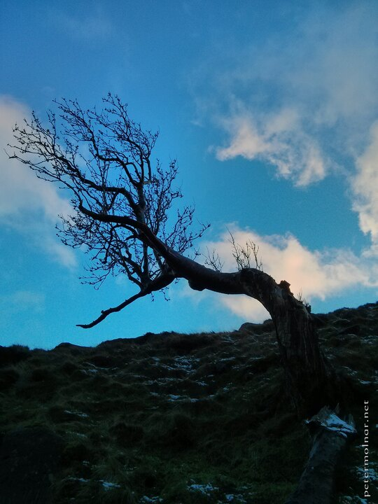

---
author:
    email: mail@petermolnar.net
    image: https://petermolnar.net/favicon.jpg
    name: Peter Molnar
    url: https://petermolnar.net
coordinates:
    latitude: 53.372678
    longitude: -1.822872
copies:
- https://www.flickr.com/photos/36003160@N08/15001780622
- http://web.archive.org/web/20141013053504/https://petermolnar.eu/photo/trees-nymph-of-the-peak-district/
published: '2014-08-22T20:00:01+00:00'
syndicate:
- https://brid.gy/publish/flickr
tags:
- Peak District
- trees
- dryad
title: Trees - Nymph of the Peak District

---

During our visit to the winter Peak District, I saw this tree - I'd
rather say, this dryad, this wood nymph. No wonder there are that many
legends and myths of woodland creatures.