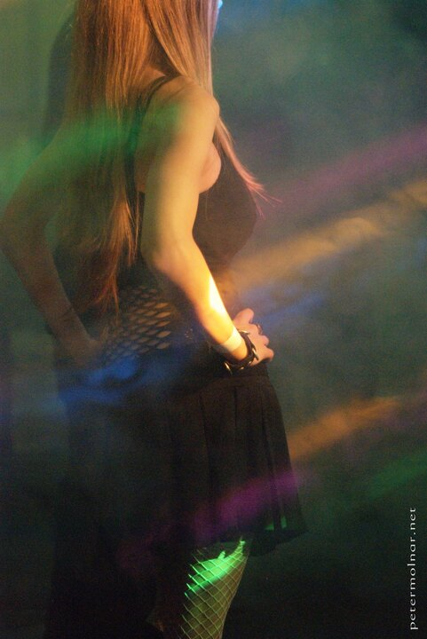

---
author:
    email: mail@petermolnar.net
    image: https://petermolnar.net/favicon.jpg
    name: Peter Molnar
    url: https://petermolnar.net
coordinates:
    latitude: 47.446505
    longitude: 19.093079
copies:
- https://www.flickr.com/photos/36003160@N08/15132733698
- http://web.archive.org/web/20141014045356/https://petermolnar.eu/photo/trick-of-the-light/
published: '2014-09-22T10:00:57+00:00'
syndicate:
- https://brid.gy/publish/flickr
tags:
- lights
- fishnets
- party
- girl
- alternative
title: Trick of the light

---

I took this at Contrast Festival 2[^1], an alternative festival took
place a few years ago. Surprisingly after the sun went down it became
much easier to take pictures; most probably because the coloured lights
became more visible.

[^1]: <http://www.ld50.hu/article/ld50/party/contrastfeszt2>