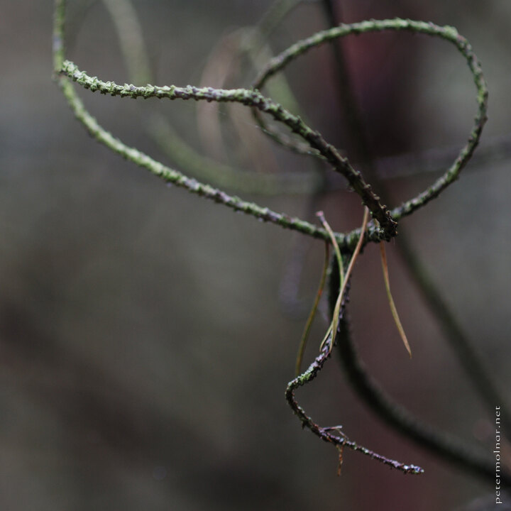

---
author:
    email: mail@petermolnar.net
    image: https://petermolnar.net/favicon.jpg
    name: Peter Molnar
    url: https://petermolnar.net
copies:
- https://www.flickr.com/photos/36003160@N08/18225338618
- http://web.archive.org/web/20190624130403/https://petermolnar.net/twister/
published: '2015-06-03T08:13:52+00:00'
syndicate:
- https://brid.gy/publish/flickr
tags:
- closeup
- forest
- macro
- horror
- pine
title: Twister

---

This was taken at an unnamed little forest somewhere around Cambridge,
in a forest where anyone comfortably could shoot a gothic horror movie;
these are branches of a pine.

For years I had trouble cropping my pictures - it felt like cheating.
This is probably due to my exposure to film photography, where you would
not really crop the negative.

Lately I realised there is nothing wrong with cropping to different
aspect ratios. I still don't like 'zooming' with cropping, but aspect
ratios, that's a different situation. If the picture is much stronger in
a different framing, I believe it's ok to make that cut. The original
2:3 landscape framing didn't really fit for it; it's much better the
square way.