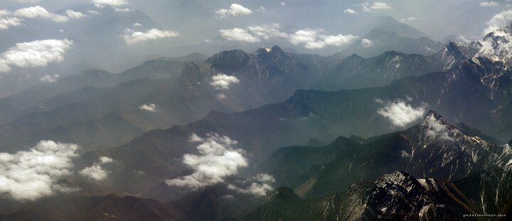

---
author:
    email: mail@petermolnar.net
    image: https://petermolnar.net/favicon.jpg
    name: Peter Molnar
    url: https://petermolnar.net
copies:
- https://www.flickr.com/photos/36003160@N08/26266035940
- http://web.archive.org/web/20160709134412/https://petermolnar.net/up-in-the-sky-1/
published: '2016-04-20T10:23:29+00:00'
syndicate:
- https://brid.gy/publish/flickr
tags:
- birds eye view
- flight
- mountain
- snow
- cloud
- peak
title: Up in the Sky 1

---

Taking photos from an commercial airplane is hard, and I barely ever
succeed. This time, probably above the Altai Mountains, I got luck and
was able to take some slightly surreal views.

I modified some colour and contrast here; also cut some from the top,
but the effect is due to the curved glass of the window.