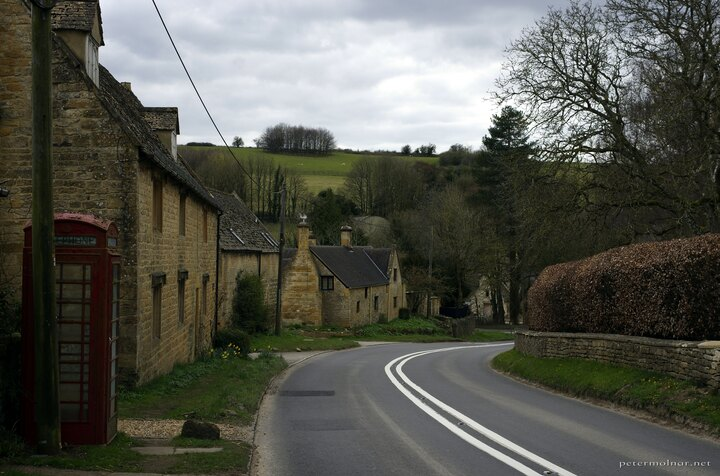

---
author:
    email: mail@petermolnar.net
    image: https://petermolnar.net/favicon.jpg
    name: Peter Molnar
    url: https://petermolnar.net
copies:
- https://www.flickr.com/photos/36003160@N08/51153508430
- http://web.archive.org/web/20210502114325/https://petermolnar.net/photo/village-of-ford/
published: '2021-05-02T09:00:00+01:00'
title: Village of Ford

---

On our way to Herefordshire we wanted to stop somewhere to eat - because
finally it's allowed to sit outside a pub instead of takeaway. When we
spotted the Plough in Ford, we stopped, though originally because the
view was absurdly beautiful. By the time we got to eating and taking our
camera out, the sun was gone, sadly, but even without sunshine on the
hills the scene is remarkable.