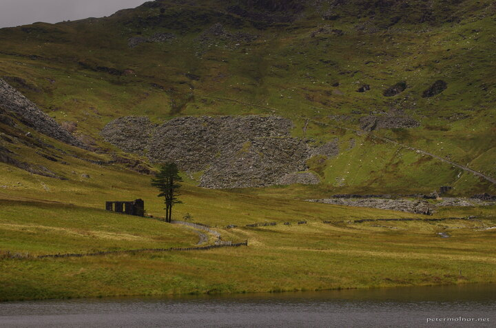

---
author:
    email: mail@petermolnar.net
    image: https://petermolnar.net/favicon.jpg
    name: Peter Molnar
    url: https://petermolnar.net
copies:
- https://www.flickr.com/photos/36003160@N08/50366523578
- http://web.archive.org/web/20200921102810/https://petermolnar.net/photo/wales-capel-rhosydd/
published: '2020-09-21T09:00:00+01:00'
tags:
- Wales
- slate trail
- ruin
- abandoned
title: Capel Rhosydd

---

Always talk to the locals; especially when they have a lovely, very
friendly dog, from whom there's no escape. Long story short: we were
recommended that once we're up at the lake, take the bridge and the
trail that goes next to the abandoned building you see on the picture -
it is supposed to lead to a whole abandoned mining town. Given the
weather - misty, with low hanging clouds - it would have been a hell of
an experience.

Unfortunately, we couldn't do this: there was no bridge. So much rain
had fallen there recently, that the bridges were literally washed away,
or sunked into the lake.