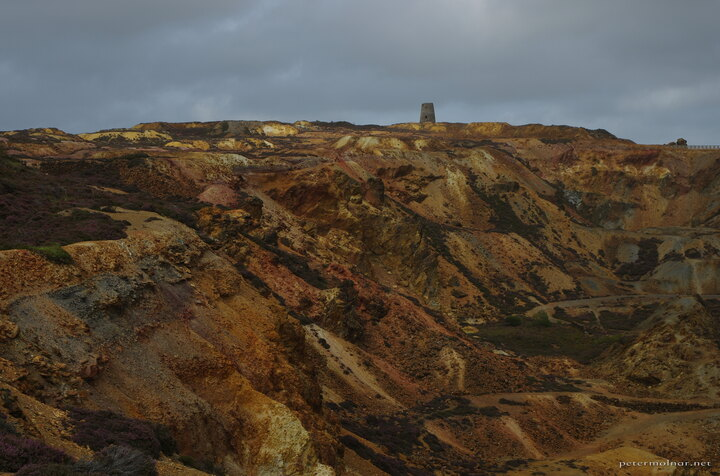

---
author:
    email: mail@petermolnar.net
    image: https://petermolnar.net/favicon.jpg
    name: Peter Molnar
    url: https://petermolnar.net
copies:
- http://web.archive.org/web/20200923081310/https://petermolnar.net/photo/wales-parys-copper-mines/
- https://www.flickr.com/photos/36003160@N08/50382560976
published: '2020-09-25T09:00:00+01:00'
tags:
- Wales
- ruin
- abandoned
- copper
- mine
- landscape
title: Parys Copper Mines

---

On the edge of Anglesey, there's an abandoned copper mine; a landscape,
shaped from the end of the 18th century till the middle of the 20th.