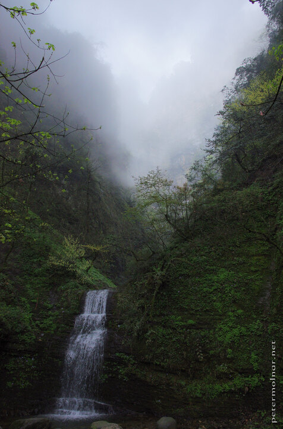

---
author:
    email: mail@petermolnar.net
    image: https://petermolnar.net/favicon.jpg
    name: Peter Molnar
    url: https://petermolnar.net
coordinates:
    latitude: 29.553114
    longitude: 103.349778
copies:
- https://www.flickr.com/photos/36003160@N08/27803702230
- http://web.archive.org/web/20190624130430/https://petermolnar.net/waterfall-at-emei-mountain/
published: '2016-07-04T16:00:53+00:00'
syndicate:
- https://brid.gy/publish/flickr
tags:
- China
- People's Republic of China
- Sichuan
- forest
- mist
- mountain
- Asia
- waterfall
- Emei
- photo
- dusk
- cloud
title: Waterfall at Emei Mountain

---

Imagine 20km stairs ahead of you and it's already dusk - that is the
point you realise you *will* spend your night at a monastery, but you
still need to hurry to get there before everything turns pitch black and
you're left with the monkeys.

So when one of the most magnificent views you've ever experienced pops
up at this time, it's a little tragic you can't spend a few hours just
there; not only to make the best photo possible but to breathe in the
crisp air, the distant, unknown noises, and the roar of the waterfall.

The waterfall, by the way, started somewhere on the left, on the very
top of the mountain, sometimes peaking out of the mist. The formations
in the background are not just clouds; most of them are mountains and
cliffs themselves.