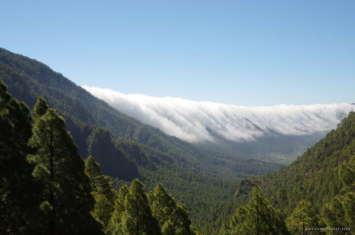

---
author:
    email: mail@petermolnar.net
    image: https://petermolnar.net/favicon.jpg
    name: Peter Molnar
    url: https://petermolnar.net
copies:
- http://web.archive.org/web/20210426114324/https://petermolnar.net/photo/waterfall-of-clouds/
- https://www.flickr.com/photos/36003160@N08/51139949148
published: '2021-04-26T09:00:00+01:00'
title: Waterfall of clouds

---

I've been meaning to post this picture for a while now, but I kept
forgetting it. The scene is from La Palma, the Canary Island; if you get
up early enough and get to the right spot, there's a high chance you'll
be greeted by a constantly moving waterfall of clouds.

However: if you're at the same spot as us, than in the empty parking
lot, you might find yourself feeding ravens instead who are friendly
enough to land on your arm. Oh, and those pines smell absolutely
wonderful when the weather is hot enough.
