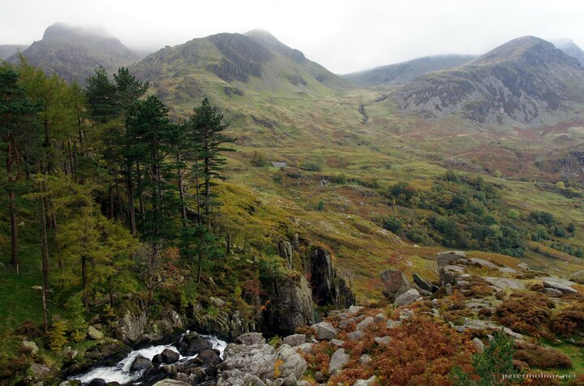

---
author:
    email: mail@petermolnar.net
    image: https://petermolnar.net/favicon.jpg
    name: Peter Molnar
    url: https://petermolnar.net
copies:
- http://web.archive.org/web/20210422114327/https://petermolnar.net/photo/welsh-october/
- https://www.flickr.com/photos/36003160@N08/51131376143
published: '2021-04-22T09:00:00+01:00'
title: Welsh October

---

During the lockdown I decided to browse through some older folders of
photographs - sometimes there are pictures that you ignore at that point
in time, but on revisit, you see them in a better light.

This was taken in 2016, in Wales; we went there for a long weekend with
another couple. The weather was far from great, though for Wales it was
still decent. Snowdonia is a wonderful place; if you have the chance,
give it a visit.
