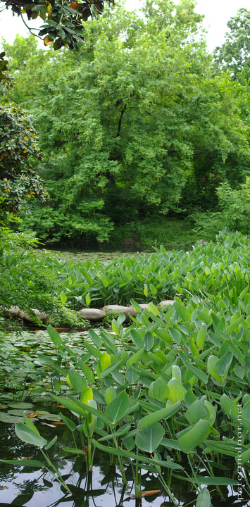

---
author:
    email: mail@petermolnar.net
    image: https://petermolnar.net/favicon.jpg
    name: Peter Molnar
    url: https://petermolnar.net
copies:
- https://www.flickr.com/photos/petermolnareu/48534629727
- http://web.archive.org/web/20190814180507/https://petermolnar.net/west-lake-greens/
published: '2019-08-14T09:00:00+01:00'
syndicate:
- https://brid.gy/publish/flickr
tags:
- China
- People's Republic of China
- Hangzhou
- West Lake
title: Greens of West Lake

---

The West Lake itself is a big, open water, but around it, especially in
the corners, there are wonderful, smaller areas, filled with lush
greens, and sprouting lotus.
