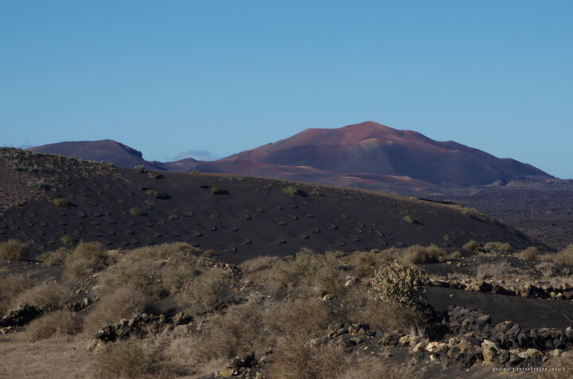

---
author:
    email: mail@petermolnar.net
    image: https://petermolnar.net/favicon.jpg
    name: Peter Molnar
    url: https://petermolnar.net
copies:
- https://www.flickr.com/photos/36003160@N08/24312560177
- http://web.archive.org/web/20190624130440/https://petermolnar.net/wine-yard-on-lanzarote/
published: '2017-12-19T08:00:00+00:00'
syndicate:
- https://brid.gy/publish/flickr
tags:
- Canary Islands
- Lanzarote
- volcano
- vulcanic
- vulcano
title: Wine yard on Lanzarote

---

On that black slope you can see small semi-circles of stones: those are
humiditiy traps with vine in their middle. Wine from Lanzarote is sweet
and very nice, and knowing it's growing on a martinan land makes it even
more exciting.