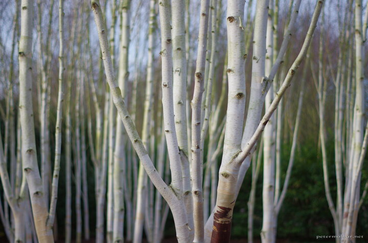

---
author:
    email: mail@petermolnar.net
    image: https://petermolnar.net/favicon.jpg
    name: Peter Molnar
    url: https://petermolnar.net
coordinates:
    latitude: 52.239495
    longitude: 0.241076
copies:
- https://www.flickr.com/photos/36003160@N08/25278135701
- http://web.archive.org/web/20160709135502/https://petermolnar.eu/winter-garden/
published: '2016-02-29T10:00:15+00:00'
syndicate:
- https://brid.gy/publish/flickr
tags:
- birch
- forest
- tree
- white
- winter
title: Winter Garden

---

Close to Cambridge there is a place, named Anglesey Abbey. It has a
unique surrounding, something called a winter garden: species and plants
from all over the world that are the most extraordinary during the not
too cold winters in East of England.