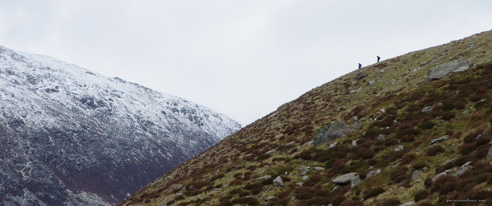

---
author:
    email: mail@petermolnar.net
    image: https://petermolnar.net/favicon.jpg
    name: Peter Molnar
    url: https://petermolnar.net
coordinates:
    latitude: 53.115584
    longitude: -4.030248
copies:
- https://www.flickr.com/photos/36003160@N08/28260961595
- http://web.archive.org/web/20160709135550/https://petermolnar.net/winter-meets-spring/
published: '2016-07-09T09:00:16+00:00'
syndicate:
- https://brid.gy/publish/flickr
tags:
- Llyn Idwal
- winter
- spring
- hikers
- cloudy
- Snowdonia
- hiking
- mountain
- clouds
- mountains
- snow
- Wales
title: Winter meets Spring

---

Sometimes winter is long; sometimes there is snow in May in Wales.
Sometimes one mountain is still covered in snow, when the other reached
spring already.

No edit, just crop.