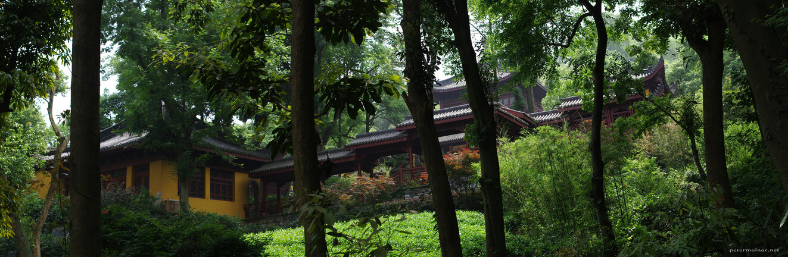

---
author:
    email: mail@petermolnar.net
    image: https://petermolnar.net/favicon.jpg
    name: Peter Molnar
    url: https://petermolnar.net
copies:
- https://www.flickr.com/photos/36003160@N08/51135823909
- http://web.archive.org/web/20210424114323/https://petermolnar.net/photo/yongfu-temple/
published: '2021-04-24T09:00:00+01:00'
title: Yongfu Temple

---

Another image from checking older picture; this is a renovated monastery
in China. Originally we were aiming to visit a huge, quite famous place
next to it, called Lingyin Temple - but when we realized that there's
yet another entrance fee, we walked away.

The hidden entrance and extra fees were a recourring theme in Anhui and
Zhejiang; Lingyin Temple wasn't that important for us to visit, and it
was just one of those "no" things that breaks the camel's back.

Anyhow, we decided to walk past the big temple, only to end up in the
lovely spot of Yongfu Temple: a rebuilt, renovated temple, with nice,
vegetarian meals.
